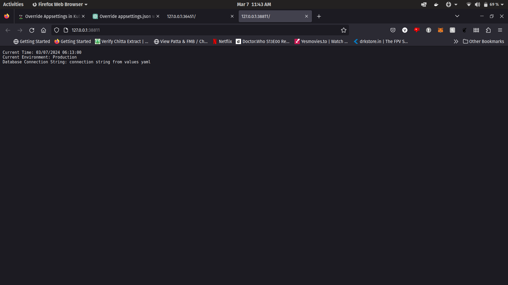

## To build the docker image:
docker build -t dotnet-print-appsettings .

## To run this image as a container:
docker run -d -p 8080:80 --name dotnet-print-appsettings-container dotnet-print-appsettings

 
visit localhost:8080 and you will see a page where three things are printed 
current time: 
environment: this is fetched from appsettings.json 
connection string: this is fetched from appsettings.json 

### The values in the appsettings.json are overriden by the values present in the helm chart

